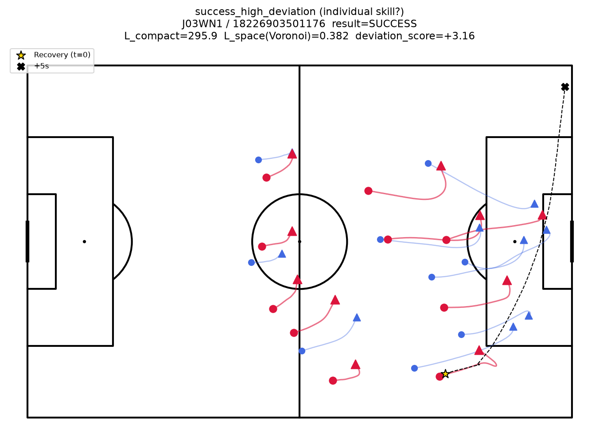
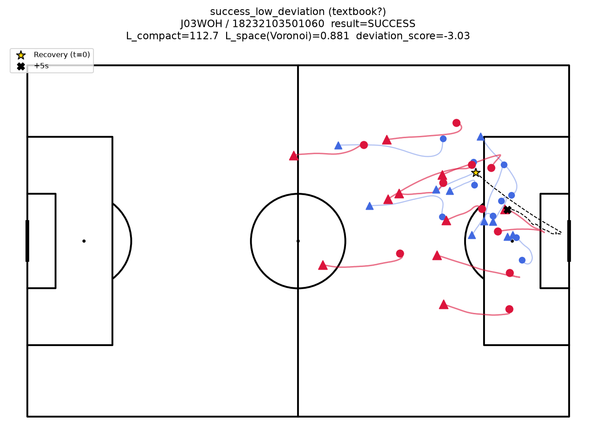
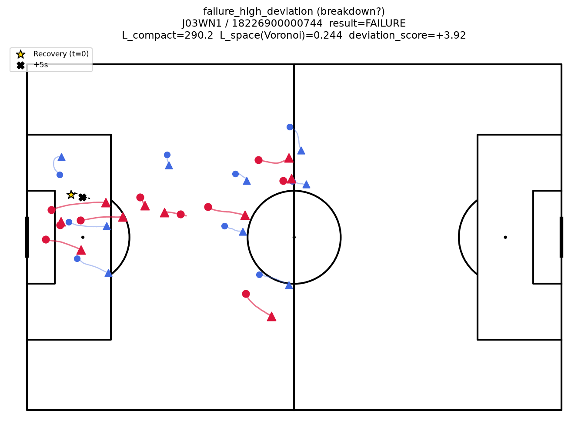
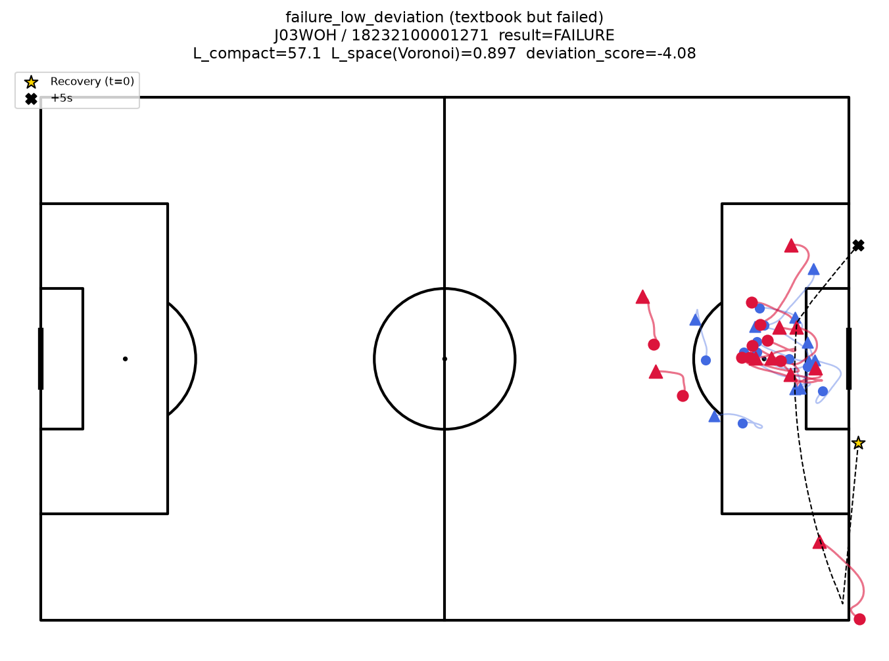
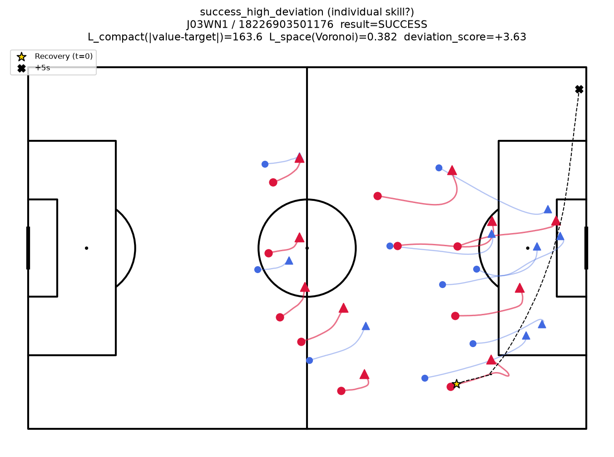
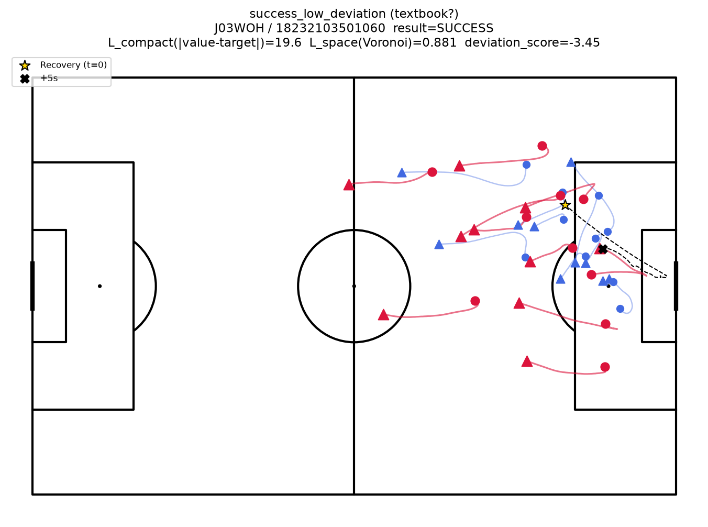
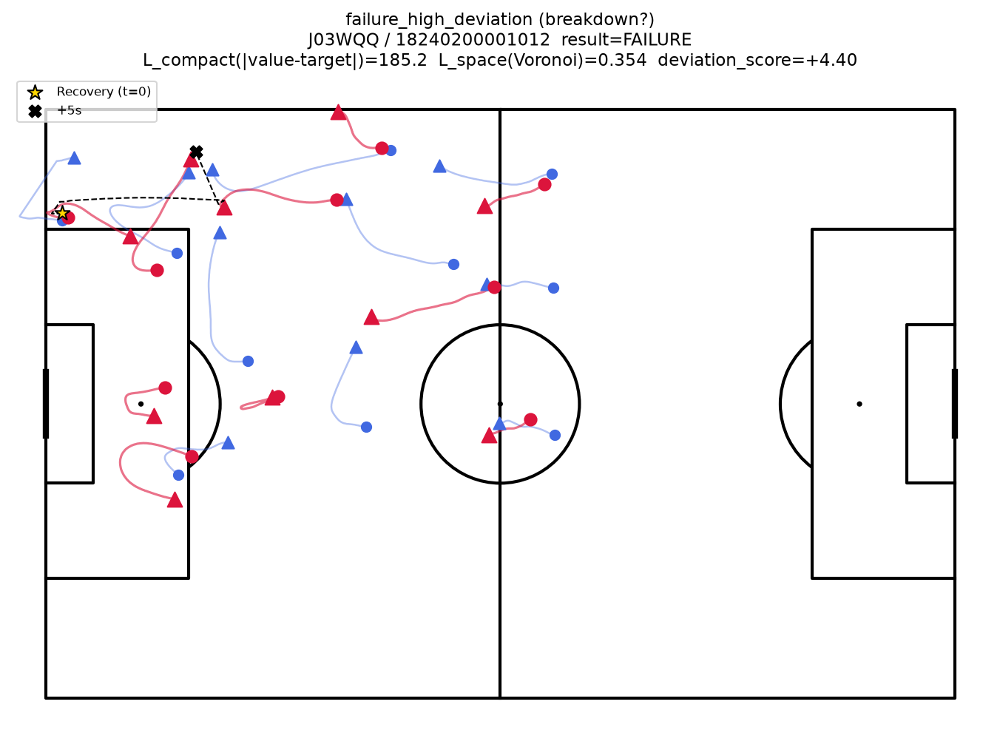
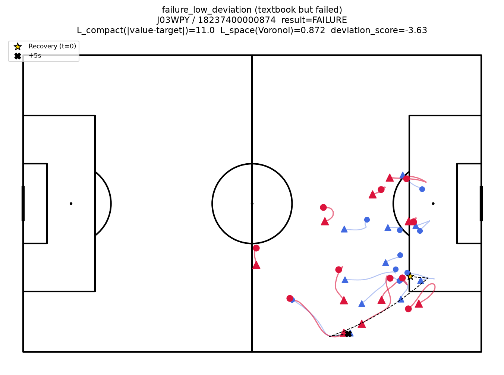

# ケーススタディ：逸脱度と結果の代表シーン

計画書6.1節・7節に対応する定性的ケーススタディの第一弾。逸脱度が高い/低いカウンターが、それぞれどのような結果（成功/失敗）と結びついているかを、代表シーンの軌道を可視化して確認する。

**現状は選定・可視化まで**。「個人技での打開に見えるか」「セオリー通りに見えるか」といった質的な判断は、サッカー経験者の目利きが必要なため未実施。

---

## 選定基準

502件の候補シーンについて、以下の逸脱度スコアを計算した。

$$\text{逸脱度スコア} = z(\text{L\_compact}) - z(\text{L\_space})$$

- `L_compact`：攻撃方向（縦）の分散（`longitudinal_variance`）。高いほど間延びしている
- `L_space`：Voronoi占有率。低いほどスペースを支配できていない
- 両者をzスコア化した上で符号を揃えて合成しているため、スコアが高いほど「間延びしていて、かつ/またはスペースを支配できていない＝セオリーから逸脱している」ことを意味する

成功イベント・失敗イベントそれぞれの中で、このスコアが最大/最小の1件を機械的に選んだ（コード：`scripts/plot_case_studies.py`）。都合の良い例を主観で選ばないよう、ルールベースの選定にしている。

---

## 4事例

### 成功 × 高逸脱（個人技での打開候補）

`J03WN1 / 18226903501176`　L_compact=295.9　L_space=0.382　逸脱度=+3.16

### 成功 × 低逸脱（セオリー通り候補）

`J03WOH / 18232103501060`　L_compact=112.7　L_space=0.881　逸脱度=-3.03

### 失敗 × 高逸脱（組織崩壊候補）

`J03WN1 / 18226900000744`　L_compact=290.2　L_space=0.244　逸脱度=+3.92

### 失敗 × 低逸脱（セオリー通りだが失敗）

`J03WOH / 18232100001271`　L_compact=57.1　L_space=0.897　逸脱度=-4.08

凡例：赤＝攻撃側選手、青＝守備側選手、丸＝観測開始位置、三角＝観測終了位置、黒破線＝ボール軌道、★＝奪取の瞬間(t=0)、✕＝5秒後。

---

## 見つかった論点：選定基準の偏り

4事例を見ると、**4件中3件で奪取地点（★）が既に相手ゴールから10〜15m以内**だった。「自陣・中盤で奪って素早く展開する」という典型的なカウンターのイメージとは異なり、ボックス付近のセカンドボール争いに近いシーンが多く選ばれている。

これは今回の逸脱度スコア（コンパクトネスとスペース支配のz-score差分）で分布の両極端を機械的に選んだ結果、選手が密集し支配関係も複雑になりやすいボックス付近の混戦が上位に来やすかったためと考えられる。「失敗×高逸脱」の1件（自陣での奪取から動けなかった事例）は、この偏りの影響を受けていない数少ない例。

「個人技での打開」を検証する題材としては、奪取地点が自陣・中盤寄りで、そこから素早く前進したシーンの方が適切と考えられる。次のイテレーションでは、奪取地点を自陣〜中盤（ピッチ半分より自陣側）に限定した上で選び直すことを検討する。

---

## 次のアクション（初版時点）

1. 奪取地点を自陣・中盤に限定して選び直す
2. 選び直した事例について、サッカー経験者としての目利きで「個人技での打開に見えるか」「セオリー通りに見えるか」を実際に判定する
3. 判定結果を踏まえ、計画書6.1節の「成功例・失敗例を提示し選定基準を明記する」という要件を満たす形でまとめる

---

## 改訂：逸脱度スコアの定義修正（L_compactを目標値からの乖離に）

初版の逸脱度スコアは`L_compact`に**生の値**（縦方向分散そのもの）を使っていたが、「逸脱」と呼ぶ以上セオリー（理想）と現実の差を見るべき、という指摘を受けて修正した。

計画書2.3節のL_compactの定義は $|\text{Var}-\text{目標値}|$ であり、目標値からの乖離を表す。目標値は観測データ全体（502件）における`longitudinal_variance`の平均値（132.29）から校正し（`tactic_metrics.compute_compactness_target`）、各イベントについて $|\text{そのイベントの値} - 132.29|$ を`L_compact`として使い直した（`tactic_metrics.compactness_deviation`）。L_spaceは計画書上も目標値という概念がなく直接最大化する量なので、生のVoronoi占有率のまま据え置いている。

**この定義変更は本ケーススタディの選定にのみ適用した。判定①〜③本体（`judge_phase0.py`、phase0_report.md）は生の値のままの従来構造を維持している**（試しに判定フェーズ全体にこの乖離の定義を適用してみたところ、縦方向分散の成功率との相関がr=+0.192→ほぼ0(r=0.002)まで消えることが分かった。「目標値からの乖離」は方向を問わないため、「間延びしているほど成功しやすい」という単調な関係が乖離を取った時点で打ち消し合ってしまうのが原因。これは判定フェーズの結論を差し替えるものではなく、別途整理する）。

### 選び直した結果

目標値との乖離で選定し直したところ、4件中2件（失敗×高逸脱・失敗×低逸脱）が別のイベントに変わった。成功側の2件は初版と同じイベントのままだった（値の大きさは変わるが、順位が変わらなかったため）。

| 区分 | match/event | L_compact(乖離) | L_space | 逸脱度スコア |
|---|---|---|---|---|
| 成功×高逸脱 | J03WN1/18226903501176（初版と同一） | 163.6 | 0.382 | +3.63 |
| 成功×低逸脱 | J03WOH/18232103501060（初版と同一） | 19.6 | 0.881 | -3.45 |
| 失敗×高逸脱 | J03WQQ/18240200001012（**新規**） | 185.2 | 0.354 | +4.40 |
| 失敗×低逸脱 | J03WPY/18237400000874（**新規**） | 11.0 | 0.872 | -3.63 |

新しい「失敗×高逸脱」（J03WQQ）は、選手が広範囲に散らばった状態で奪取し、5秒後もボールがほとんど前進していない、という初版より分かりやすい「組織崩壊」の絵になった。一方「失敗×低逸脱」（J03WPY）は、初版と同様に奪取地点が既にゴール至近（コーナー付近）で、依然として「選定基準の偏り」節で指摘した問題（奪取地点がゴール近くに偏る）が残っている。この点は未解消のため、次のアクションの1（奪取地点を自陣・中盤に限定）は引き続き有効な改善案。

### 次のアクション（更新）

1. 奪取地点を自陣・中盤に限定して選び直す（未着手、引き続き有効）
2. 選び直した事例について、サッカー経験者としての目利きで「個人技での打開に見えるか」「セオリー通りに見えるか」を実際に判定する（未着手）
3. 判定結果を踏まえ、計画書6.1節の要件を満たす形でまとめる（未着手）
