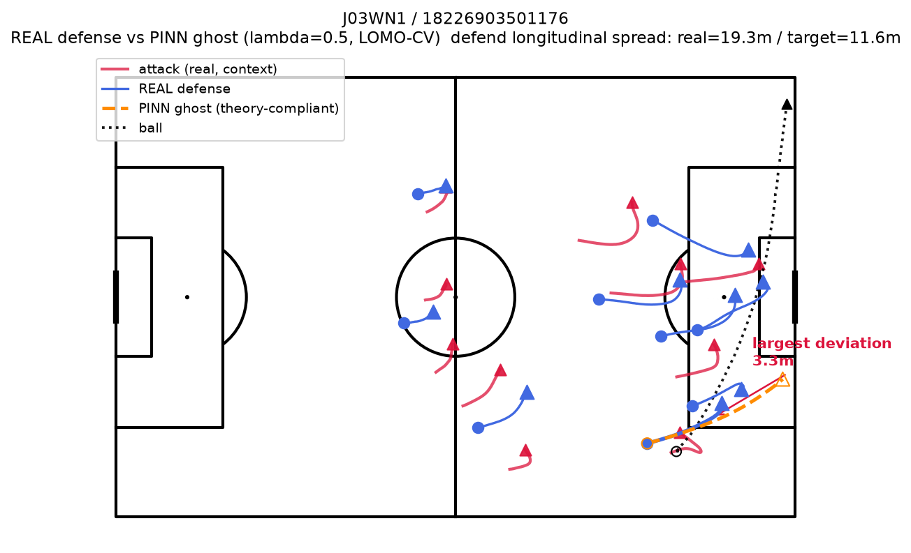
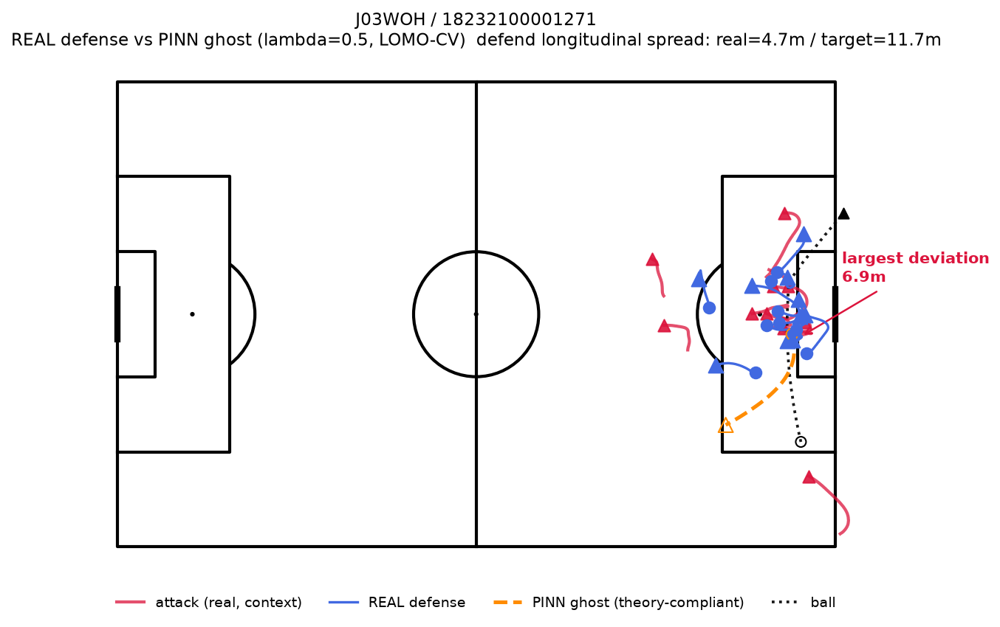
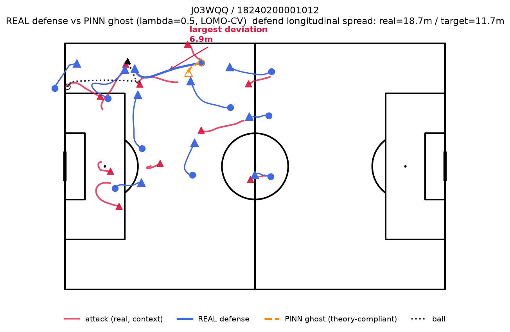
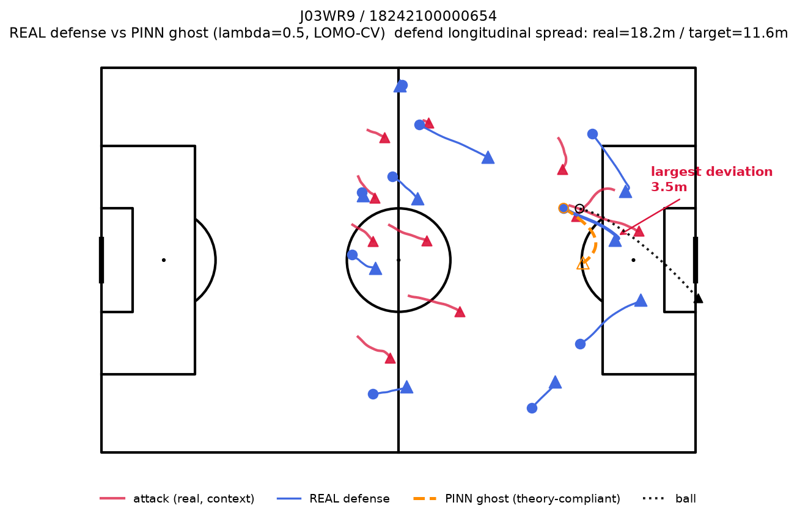

# 指導現場向け可視化の試作：実際の守備 vs PINNゴースト（選手単位の逸脱強調）

計画書11.9節の先、指導現場での活用案の試作。3者比較ケーススタディ（`three_way_comparison_report.md`）を見て「PINNゴーストがコンパクトネスを守った軌道を生成できているのか分かりにくい」という指摘があり、そこで見つかった2つの方法論上の問題（後述）を修正した上で、より個別選手に注目した可視化を試みた。

コード：`scripts/coaching_overlay_prototype.py`。画像：`documents/coaching_overlay_images/`

## 3者比較との違い

3者比較を見返した際に、2つの問題が見つかった。

1. **ランキングに使ったモデルと可視化対象のモデルが別物だった**：3者比較のdist_Bはλ=0.5・LOMO-CVアンサンブルモデルの値だが、実際に描かれていたのは同じスクリプト内で新たに学習し直したλ=8・単一seedのモデルだった
2. **modelA/modelBとも、可視化対象のイベントを含む全502件で学習していた**（ホールドアウトなし）。実際の軌道を学習データとして見た状態で予測しており、実観測に引っ張られて似た軌道になりやすい

これを踏まえ、本試作では以下のように変更した。

- **事例選定**：「dist_Bランキング上位」ではなく、**実際の守備の縦方向の広がり（σx）が全体平均（target_std）から最も乖離している事例**を選ぶ。dist_Bランキング上位×in-sample学習だと実際とほぼ変わらない軌道になりがちだと分かったため
- **学習方法**：運用上の主指標と同じλ=0.5・**LOMO-CV**（対象イベントが属する試合をホールドアウトして学習）で予測する
- **可視化**：4パネル横並びではなく、1枚のピッチにREAL（実線）とPINNゴースト（破線）を重ねて描く。ゴーストは全選手ではなく、**実際とPINNゴーストの平均距離が最大だった1選手のみ**を強調して描画する（他の選手は実際の軌道のみ）

## 図の見方

| 要素 | 色・線種 | 意味 |
|---|---|---|
| クリムゾンの太線・▲ | 攻撃側（実観測） | 比較対象ではなく、固定した前提条件として表示 |
| 青の実線・○（開始）・▲（終了） | 実際の守備 | 全選手について表示 |
| オレンジの点線・○（開始、白抜き）・▲（終了、白抜き） | PINNゴースト | **最大逸脱選手のみ**表示 |
| 黒の点線・○（開始）・▲（終了） | ボール | |
| 赤字の注釈 | 最大逸脱選手の逸脱量(m) | 実際とPINNゴーストの全フレーム平均距離 |

攻撃方向は常に左→右（+x方向、既存の図と同じ正規化）。凡例はピッチ下部に配置している（初期版でピッチ左上に固定していたところ、プレーが左上で起きた事例と重なって読めなくなる問題があったため、ピッチ外に移動した）。

## 事例

事例選定は、実際の守備の縦方向の広がり（σx）が全体平均（target_std≈11.6〜11.7m）から乖離している上位から、試合の多様性・乖離の方向（間延び/過密）の多様性を確保して4件選んだ。

| 試合 / イベント | 実際のσx | 目標 | 乖離の方向 | 最大逸脱選手の距離 |
|---|---|---|---|---|
| J03WN1 / 18226903501176 | 19.3m | 11.6m | 間延び | 10.1m |
| J03WOH / 18232100001271 | 4.7m | 11.7m | 過密 | 6.9m |
| J03WQQ / 18240200001012 | 18.7m | 11.7m | 間延び | 6.9m |
| J03WR9 / 18242100000654 | 18.2m | 11.6m | 間延び | 3.5m |

### J03WN1 / 18226903501176（間延び、乖離10.1m）

最大逸脱選手はゴールライン際・ボックス角付近の選手。実際は攻撃側の選手（ボール保持者に近い位置）に寄って対応していたが、PINNゴーストはボックス外側まで開いていく軌道を示している。ボールは同じ選手の近くから、ピッチ幅をほぼ全幅横切ってゴールライン際まで進んでおり、クロス・サイドチェンジに近い軌道と解釈できる（kloppyデータにイベント種別のラベルはないため、位置情報からの幾何学的な解釈に留まる）。4件中もっとも見やすい例。

### J03WOH / 18232100001271（過密、乖離6.9m）

実際の守備はゴール前に極端に密集していた（σx=4.7m、目標の半分以下）。最大逸脱選手について、PINNゴーストは密集から離れて下がる方向を示しており、「密集しすぎ」への修正として解釈しやすい。J03WN1と並んで見やすい例。

### J03WQQ / 18240200001012（間延び、乖離6.9m）

コーナー付近での乖離。数値上はJ03WOHと同じ6.9mだが、攻撃側の軌道が密集していて画面が煩雑なため、単体で見たときの分かりやすさはやや劣る。

### J03WR9 / 18242100000654（間延び、乖離3.5m）

4件中もっとも乖離が小さく（3.5m）、実際とPINNゴーストの線がかなり近い。単体で見せても説得力は弱い。

## 評価・位置づけ

4件中2件（J03WN1、J03WOH）は一目で意味が分かる、指導教材として使えるレベル。残り2件（J03WQQ、J03WR9）は「言われてみればそう」程度で、単体では説得力に欠ける。

この「はっきり見える事例とそうでない事例が混在する」という結果は、都合の悪いノイズではなく、**これまでの定量結果（dist_B単体のAUC=0.610、上位10%でLift=1.94倍、`lift_precision_at_k_report.md`）が示す「弱いが一貫して本物」という性質を、そのまま個別事例の絵にしたもの**と理解するのが正確である。選定方法とLOMO-CVを直したことで3者比較よりは見える事例を作れるようになったが、「この可視化さえあれば説得力が生まれる」というほどの決定打にはならなかった。

したがって、この可視化は**主張の中心には据えず、補助的な参考資料**として位置づける。研究の主張の重心は引き続き①方法論（異分野からの輸入：ハード/ソフト制約の分離、ランキング/発見ツールとしての評価枠組み）②定量的なランキング結果（AUC・Lift/Precision@K）に置き、本可視化は「うまくいく場合の具体例」としてJ03WN1・J03WOHの2件のみを添える形が誠実な使い方である。
