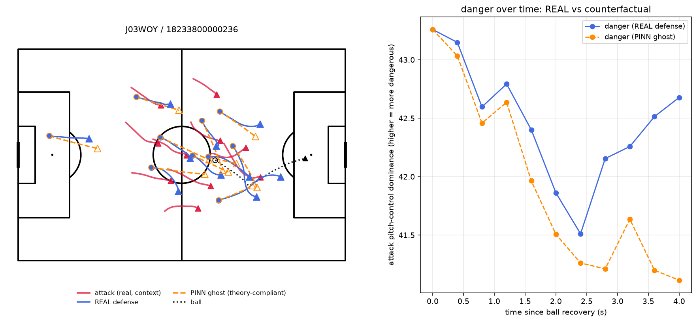
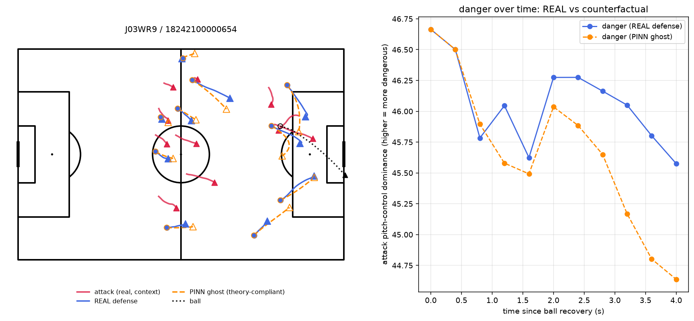
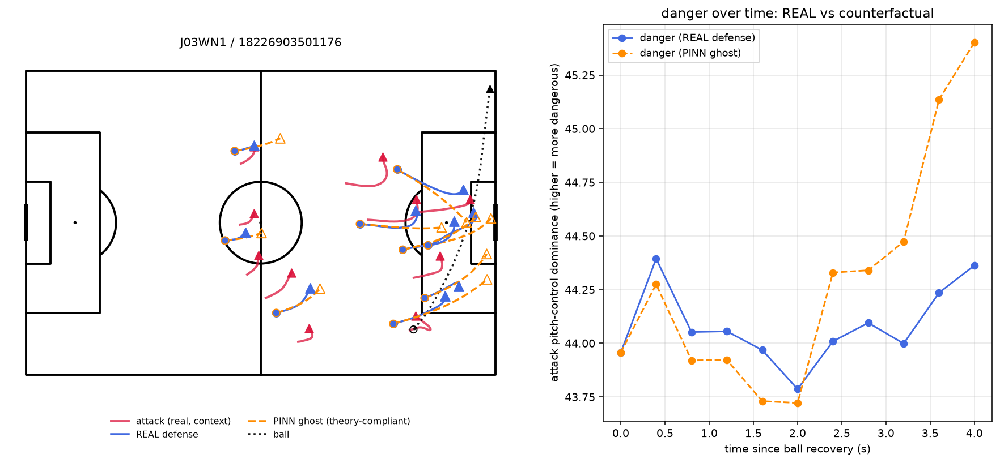

# 擬似的な反実仮想シミュレーション：守備をPINNゴーストに差し替えたときの危険度比較

計画書12.2節に対応。実際に成功（label=1、失点相当の代理指標）したカウンター局面について、守備側だけをmodelB（PINNゴースト、λ=0.5・LOMO-CV）の予測に差し替え、攻撃側・ボールは実観測のまま固定した上で、`space_control.py`のピッチコントロール（守備配置に反応する指標）で危険度を比較した。

コード：`scripts/counterfactual_pitch_control.py`。画像：`documents/counterfactual_images/`

## 方法

- **事例選定**：label=1（成功、失点相当の代理指標）かつボールが実質的に動いている事例（デッドボール除外、`three_way_comparison.py`と同じ基準）から、実際の守備コンパクトネスがtarget_stdから最も乖離している事例を、試合の多様性を確保して4件選定
- **モデル**：該当試合をホールドアウトしたLOMO-CVでmodelB（λ=0.5、運用上の主指標と同じ設定）を単一seedで学習・予測
- **危険度の計算**：攻撃側・ボールは実観測のまま固定し、守備側を①実際の軌道②modelBのPINNゴーストの2パターン用意。4秒間を10フレーム（0.4秒）おきに区切り、各時点で`isotropic_gaussian_dominance`（選手近傍の攻撃側支配面積の平方根、m単位）を計算し、時系列として比較する

## 図の見方

左：ピッチ図。クリムゾン＝攻撃側（実観測、固定）、青の実線＝実際の守備、オレンジの点線＝PINNゴースト、黒の点線＝ボール。○＝開始位置、▲＝終了位置。

右：危険度の時系列。縦軸は攻撃側のピッチコントロール優勢度（値が大きいほど攻撃側がピッチを支配し危険）。青＝実際の守備での危険度、オレンジ＝PINNゴーストに差し替えた場合の危険度。

## 結果

| 事例 | 危険度（実際、平均） | 危険度（ゴースト、平均） | 差 |
|---|---|---|---|
| J03WOH / 18232100000065 | 40.99 | 39.98 | -1.01 |
| J03WOY / 18233800000236 | 42.47 | 41.93 | -0.54 |
| J03WR9 / 18242100000654 | 46.07 | 45.66 | -0.40 |
| J03WN1 / 18226903501176 | 44.08 | 44.29 | +0.21 |

### J03WOH / 18232100000065（差 -1.01、最も明確な事例）

奪取から1.5秒以降、実際の危険度がほぼ横ばいで推移するのに対し、PINNゴーストでの危険度は継続的に下がり続け、4秒後には実際より2.5ポイント低い水準に達している。4事例中もっとも明確に「セオリー通りの守備なら危険度を抑えられていた」ことが視覚化できた事例。

### J03WOY / 18233800000236（差 -0.54）

大半の時間帯でオレンジ（ゴースト）が青（実際）を下回っており、特に終盤（3〜4秒）で実際の危険度が再上昇するのに対しゴーストは低い水準を保っている。

### J03WR9 / 18242100000654（差 -0.40）

終盤（2〜4秒）でゴーストの危険度が実際を下回る傾向が見える。

### J03WN1 / 18226903501176（差 +0.21、逆方向の事例）

他3事例と異なり、2秒以降ゴーストの危険度が実際を上回り、4秒後には実際より1.2ポイント高い水準に達している。セオリー通りの守備配置への補正が、この局面ではむしろ攻撃側に空間を与える結果になったことを示す、正直な逆方向の事例。

## 解釈

4事例中3件で「セオリー通りの守備なら危険度が低かった」という、直感と整合する結果が得られた一方、1件は逆方向だった。これは「理論に従えば常に安全になる」という単純な主張ではなく、**弱いが一貫した傾向がある（が万能ではない）**という、これまでのランキング評価（AUC=0.610）・3者比較・ノイズの床の確認全体を通じて一貫している結論と整合する。

## 限界（必ず併記する）

- **攻撃側は実観測のまま固定**しており、実際には守備配置の変化に攻撃側が反応した可能性がある（SUTVA違反、計画書12.3節）。この反実仮想は「攻撃側が気づかない・反応しない」という前提の上に成り立っている
- **反実仮想を評価する指標（ピッチコントロール）自体が正しいという、別の前提に依存する二重の近似**である（計画書12.3節）
- **modelBのゴースト軌道が個別に「正しい」ことを直接検証する手段は存在しない**（因果推論の根本問題、計画書12.5節）。ここで示しているのは、あくまで「もっともらしい代替仮説」による例示であり、統計的な証明ではない
- 事例によって効果の向き・大きさにばらつきがある（4件中1件は逆方向）ことは、効果が弱いことの反映であり、恣意的に選んだわけではない
