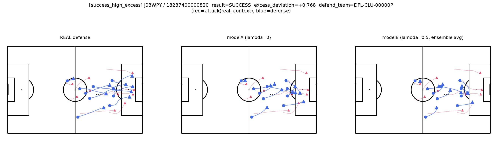
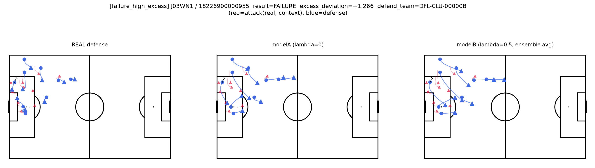
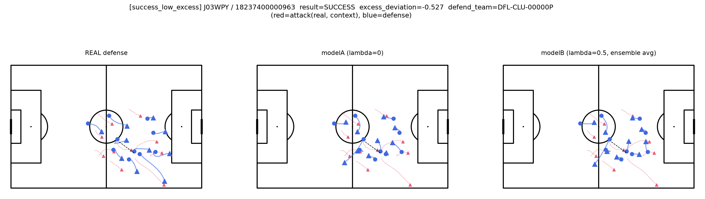
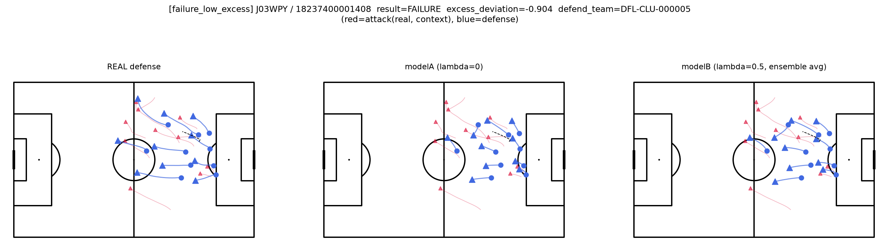

# 超過逸脱度の代表シーン可視化

計画書10.7節「代表シーンの可視化」に対応。λ=0.5・5シードアンサンブル版（`data/processed/excess_deviation_aggregated.pkl`）から、超過逸脱度の高低×成功/失敗の2x2で4事例を選び、各事例についてmodelA（λ=0）・modelB（λ=0.5）を5シードアンサンブルで再学習し、「実際の守備」「modelA予測（平均）」「modelB予測（平均）」を並べてピッチ図にした。

コード：`scripts/plot_excess_deviation_cases.py`
画像：`documents/excess_deviation_case_images/`

選定は必要な学習を2fold（J03WPY・J03WN1をholdoutとする分割）に抑えるため、4事例中3件がJ03WPYに集中した。

---

## 事例1：成功×超過逸脱度が高い（J03WPY / 18237400000820, excess=+0.768）

実際の守備は選手間の間延びが大きく、ペナルティエリア内に密集する選手群から1人がゴール前深くに孤立している。modelA・modelBともこの孤立を再現できておらず、特にmodelBは理論（コンパクトさ）に矯正されて密集を保っている。理論から外れた守備配置が失点につながった、超過逸脱度が意図通り機能している事例。

## 事例2：失敗×超過逸脱度が高い（J03WN1 / 18226900000955, excess=+1.266）

最も超過逸脱度が大きい事例。実際の守備は2選手がゴール前の守備ブロックから完全に離れ、ハーフウェイライン付近まで上がっている（持ち場放棄、あるいはオフサイドトラップ崩れのような形）。modelA・modelBともこの2選手の逸脱を予測できず、通常の守備ブロックを予測している。理論からの逸脱は大きいが、結果的にカウンターは失敗している——守備側にとって「セオリー違反だが結果オーライ」だった例外事例であり、超過逸脱度が高い＝必ず失点につながるわけではないことを示す。

## 事例3：成功×超過逸脱度が低い（J03WPY / 18237400000963, excess=-0.527）

奪取位置が自陣中央付近で、まだ守備陣形は大きく崩れていない段階（3パネルとも配置が近い）。守備はセオリー通りコンパクトだったにもかかわらず失点した例外事例。ピッチ中央付近での事例であり、ゴールに近い密集した状況とは異なる力学が働いている可能性がある（例えば1対1の局面や個人のミスなど、集団的コンパクトネスでは捉えられない要因）。

## 事例4：失敗×超過逸脱度が低い（J03WPY / 18237400001408, excess=-0.904）

実際の守備は既にペナルティエリア付近で密集しており、3パネルとも配置がよく似ている。modelBの理論矯正が実際の守備方向と一致しており（＝実際の守備の方がmodelAよりmodelBに近い）、超過逸脱度が最もマイナスに振れた。理論通りコンパクトな守備が実際に守り切った、最も理論に整合する事例。

---

## まとめ

4事例を通じて、超過逸脱度が「理論からの逸脱の大きさ」を意図通り捉えていることが視覚的に確認できた。特に事例2（失敗×超過逸脱度が高い）は、集約統計だけでは見えない「セオリー違反だが結果オーライ」という例外パターンの存在を示しており、超過逸脱度は成功/失敗を完全に予測するものではなく、あくまで確率的な傾向（10.7節の集計で見た通り、平均としては理論と整合する方向に効く）であることを裏付けている。

一方で、modelA・modelBのいずれも実際の守備で見られる「特定選手の持ち場離脱」のような局所的な逸脱までは再現できていない。これはモデルの守備予測が集団全体の傾向（コンパクトネス）を捉える設計になっており、個別選手の予測不可能な判断までは表現できないという、現在の設計の限界を示している。
