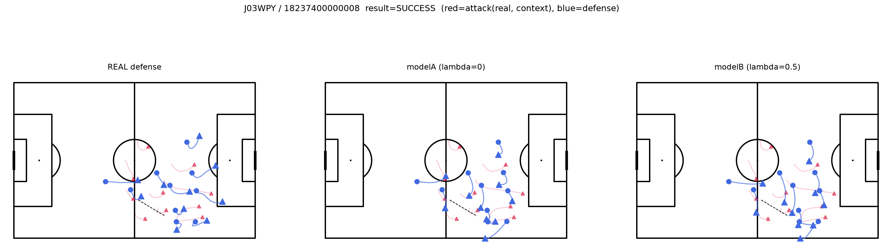
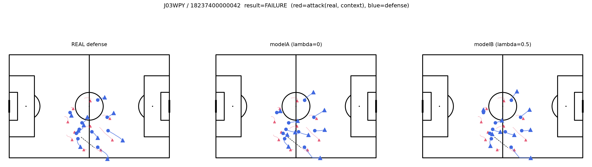
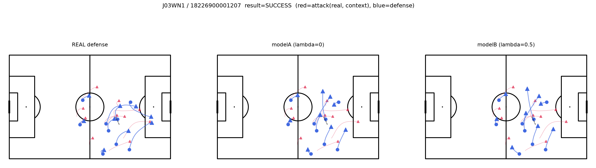
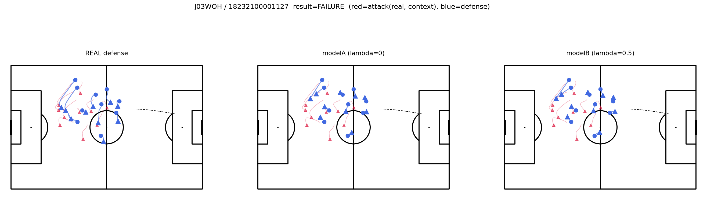

# modelB単体のサニティチェック（λ=0.5、再実施）

`documents/modelB_sanity_check_report.md`はλ=8時点の結果だったが、複数シード確認（`documents/stage3_multiseed_report.md`）でλ=8の効果は頑健でないと判明し、λ=0.5が最も再現性の高い設定として採用されたため、同じ4事例（成功2・失敗2、λ=8チェックと同一イベント）でサニティチェックを再実施した。

コード：`scripts/sanity_check_modelB.py`（`OUT_DIR`を`modelB_sanity_check_lam0.5`に変更、λ=0.5で学習）

## 結果

4事例（`documents/modelB_sanity_check_lam0.5_images/`）とも：

- ピッチ外逸脱・選手の1点崩壊なし。modelA・modelBともプレーが実際に起きていたエリアに留まっている
- λ=0.5はλ=8よりマイルドな矯正のため、modelBの出力はmodelAとかなり近い（想定通り）。過剰な歪みや不自然な密集は見られない

## 結論

λ=0.5でもmodelBの出力は「もっともらしい守備」という位置づけに耐える。λ=8のチェック時ほど視覚的な違いは目立たないが（矯正が弱いので当然）、不自然な崩壊がないことは確認できた。サニティチェックはλ=0.5でもクリア。

