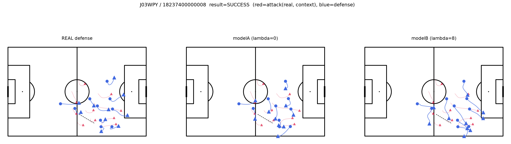
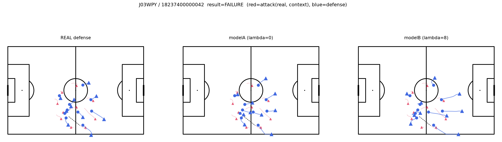
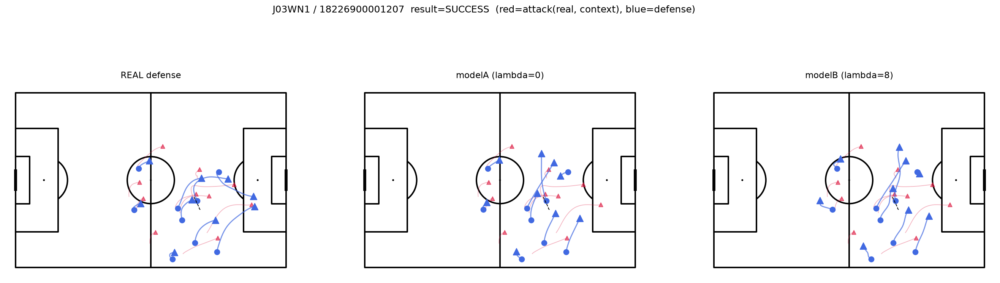
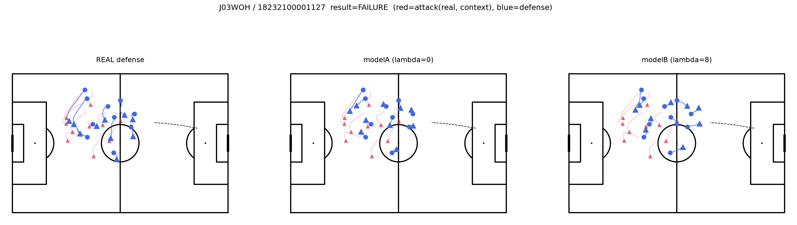

# modelB単体のサニティチェック

`resarch_plan.md` 10.8節の未決定事項「modelB単体のサニティチェック」の実施記録。段階2の数値的な退化解チェック（選手間距離の崩壊有無）は通過していたが、「崩壊していない」ことと「もっともらしい守備に見えるか」は別問題のため、目視で確認した。

コード：`scripts/sanity_check_modelB.py`

## 方法

全502件でmodelA（λ=0）・modelB（λ=8、段階3で統計的に有意だった設定）を学習し、成功2件・失敗2件（異なる試合から）を選んで、実際の守備・modelA予測・modelB予測を並べてピッチ図にプロットした。

## 結果

4事例（`documents/modelB_sanity_check_images/`）とも：

- modelA・modelBとも、ピッチ内・実際にプレーが起きていたエリアに留まり、選手個々を判別できる形を保っている（1点への崩壊、ピッチ外へのワープなし）
- **modelB（λ=8）は、modelA・実際の守備と比べて視覚的にも明確に密集している**（特にevent0, event1で顕著）。コンパクトネス制約が意図通り働いており、崩壊ではなく「より組織立った守備陣形」に見える

## 結論

数値チェック（段階2）に続き、目視でもmodelBの出力は「セオリーに忠実な、もっともらしい守備」という位置づけに耐えると判断する。サニティチェックはクリア。

