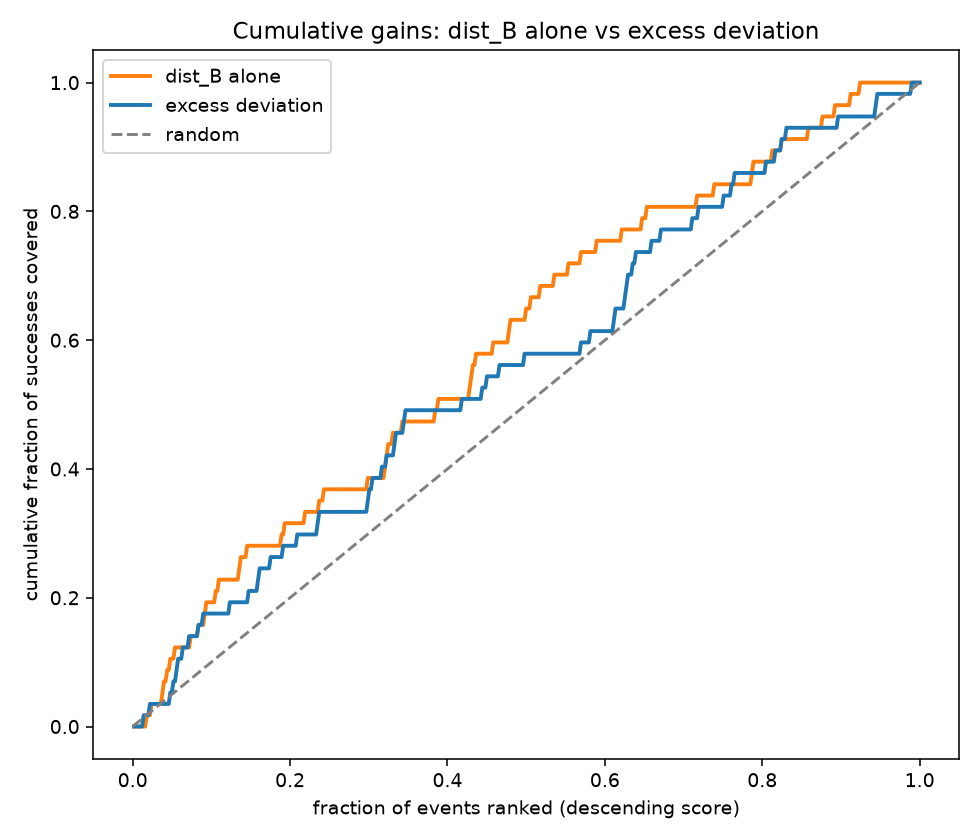
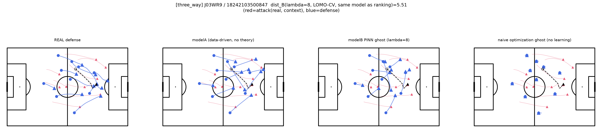
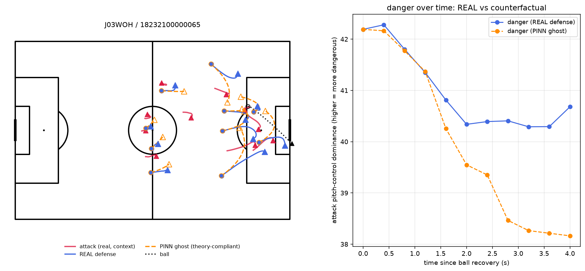
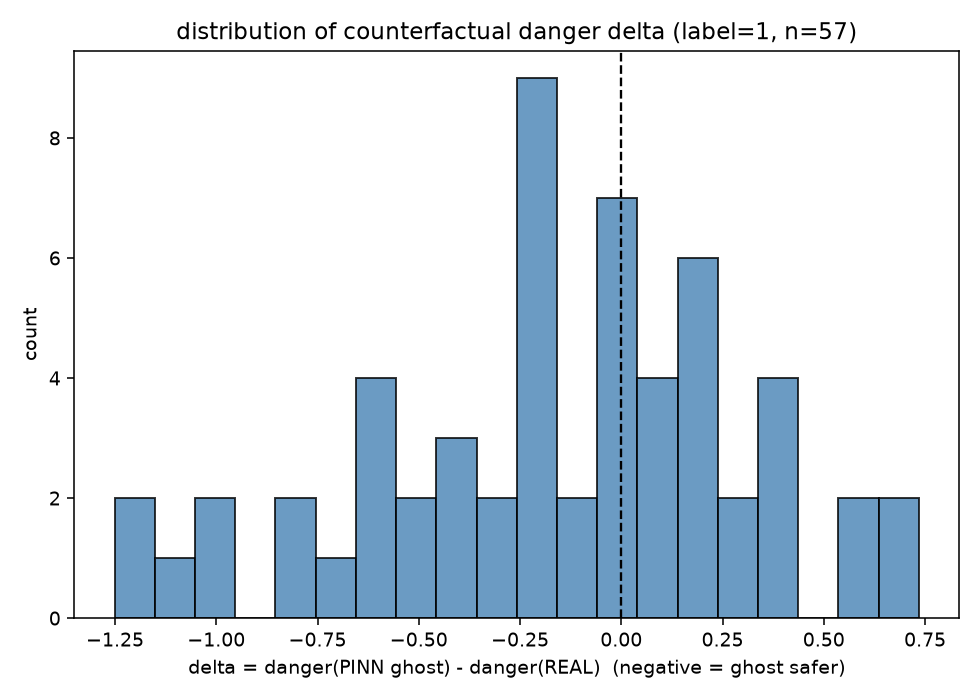

# ポスター原稿（研究会発表用）

構成は前回合意した4パネル案に基づく。図の挿入位置は`[図: ...]`で示す。文章量はポスターの1パネル分を想定し、簡潔にしている。

---

## タイトル案

**セオリーからの逸脱を発見する：物理制約×戦術理論のゴーストモデルによるサッカー守備分析**

副題（あれば）：ハード/ソフト制約つき軌道予測モデルによる、カウンター攻撃時の守備コンパクトネス評価

---

## 1. 背景・研究目的

サッカーのカウンター攻撃において、守備側が間延びせず「コンパクトネス」を保つことは、古典的な戦術セオリーとされる。しかし、実際のプレーが理論からどれだけ逸脱していたかを、トラッキングデータから定量的に見出す手法は確立していない。

あらかじめ決めた一律の「理想形」と実際の配置を比べるだけでは、その乖離が「セオリーへの違反」なのか「単に守りにくい局面だった」だけなのかを見分けられない。かといって、理想形を、実データに基づく学習なしに、理論項だけを直接最適化して求めると、データとの整合性を失った不自然な軌道になってしまう。

本研究は、選手トラッキングデータ（idsse-data、Bundesliga 7試合、カウンター攻撃502件）を用い、物理的制約（ハード制約）と戦術理論（ソフト制約）を組み込んだ軌道予測モデルを提案する。局面を踏まえつつ実データに即した「理論に忠実な守備」を生成することで、この2つを分離して測定・発見する。

---

## 2. 手法

**ハード制約**（物理的に破れない）：最大速度・最大加速度・ピッチ境界を、モデルのアーキテクチャ内部（積分・射影層）に直接組み込む。損失関数に頼らず、構造的に違反を許さない。

**ソフト制約**（破りうる規範）：コンパクトネスという戦術理論を、損失関数へのペナルティ項として加える。このペナルティの重み（強さ）を**λ**という1つの数値で表し、**λ=0なら理論を一切考慮せず、λを大きくするほど理論への忠実さを強く求める**。

**2つのghost（仮想軌道）モデル**

以降、モデルが生成する予測軌道を「ゴースト」と呼ぶ（スポーツ分析分野で、実際には存在しないが仮想的に生成した軌道を指す一般的な用語）。

- **modelA**（データ駆動ゴースト、λ=0＝理論のペナルティなし）：理論なし、実際の守備行動を模倣する基準線
- **modelB**（戦術理論ゴースト、λ>0＝理論のペナルティを効かせる）：理論に忠実な「あるべき守備」を生成

**設計転換：測定器から発見ツールへ**

当初は、modelAとmodelBの予測誤差の差（超過逸脱度）を使って、乖離の大きさを統計的に厳密に推定しようとした。しかし7試合というデータ規模では、①同じ試合・チームが繰り返し登場する（疑似反復）、②2つの独立したモデルの誤差を引き算するとブレが増幅する、③modelBが理論に引っ張られる分もともと実データから離れやすい、といった小標本特有の制約により、点推定の精度には限界があることが分かった。

そこで、乖離度を精密な推定値としてではなく、危険な局面を効率的に絞り込む**「発見的なランキングツール」**として使う設計に転換した。実際の守備とmodelBの距離（dist_B）でカウンター局面をランキングし、上位に成功シーンがどれだけ濃縮されるか（Lift/Precision@K）で評価する。この設計は、ランキング（相対順位）が構造的バイアス（ほぼ一定オフセット）の影響を受けにくいという利点も持つ。

---

## 3. 結果

**定量評価**：dist_Bによるランキングは AUC=0.610、上位10%でLift=1.94倍（成功率が全体平均11.4%の約2倍に濃縮）という、弱いが一貫した判別力を示した。

**図の見方（この先のピッチ図に共通）**：赤＝攻撃側（実観測、固定）、青＝実際の守備、オレンジの点線＝戦術理論ゴースト、黒の点線＝ボール。**○＝予測開始時点（ボール奪取後1秒）の位置、▲＝終了時点（約4秒後）の位置**（丸から三角へ向かう向きが、その4秒間の移動を表す）。

**定性評価（目的：なぜPINN的な設計が必要かを示す。「セオリー通りなら防げたか」の検証はこの後の反実仮想シミュレーションで別途行う）**：①戦術理論ゴースト②ナイーブな理論最適化ゴースト（実データに基づく学習を一切行わず、最終観測位置を出発点として、コンパクトネス損失だけを直接最適化して生成）③modelAの3者を代表シーンで比較した。②は攻撃の前進に追従できず「静止」するという不自然な失敗モードを示したのに対し、①戦術理論ゴーストは③ほど自由ではないが②のような不自然さもなく、理論に忠実かつ動的に現実的な軌道を生成できることを確認した。

**反実仮想シミュレーション（目的：セオリー通りの守備なら危険度がどう変わるかを直接検証。上記の3者比較とは別の事例・別の分析）**：実際に成功したカウンター局面（失点相当の代理指標、n=57）について、守備側だけを戦術理論ゴーストに差し替え、攻撃側は実観測のまま固定した上で、ピッチコントロール（守備配置に反応する危険度指標）を再計算した。**61.4%の事例でゴーストに差し替えた方が危険度が下がり、平均でも低下する方向**（delta平均-0.166）となった。

ただし全局面（成功・失敗を問わない446件）に一律適用すると、平均ではわずかに危険度が上がる方向に転じる（delta平均+0.136）。これは、コンパクトネスの目標値が全データの**平均**であり局面の文脈（攻撃の幅・スピード等）に適応していないためと考えられ、「危険な局面への補正としては機能するが、万能な処方箋ではない」という誠実な結論を導く。

---

## 4. 考察・今後の展望

本研究の学術的な位置づけは、「守備のセオリー逸脱を発見した」こと自体より、既存の指標では扱えなかった問題——守備の乱れが理論違反によるものか、単に守りにくい局面だっただけなのかを区別できないという問題、そして7試合という少ないデータでは、乖離の大きさを精密な数値として求めても信頼できないという問題——に対し、ハード/ソフト制約の分離と、精密な推定に頼らないランキング評価という、データ制約に見合った検証の枠組みを構築した点にある。

本研究が生成する「戦術理論ゴースト」の個々の軌道が本当に正しいかを直接検証する手段は、原理的に存在しない（実際に起きたことと、起きなかった可能性を同時に観測できないため）。この限界は本研究固有のものではなく、理想軌道生成・反実仮想を扱うタスク全般に共通する構造的な壁であり、本研究の評価設計（集団・統計レベルでの間接検証）はこの壁への対処にもなっている。

反実仮想シミュレーションによって、「セオリー補正は危険な局面に対しては機能するが、状況を選ばず適用すると逆効果になりうる」という、当初の想定より一段解像度の高い知見も得られた。

**今後の展望**
- コンパクトネスの目標値を試合状況（スコア差・残り時間・攻撃の幅等）に応じて動的に変える、状況依存の理論条件付け（今回、画一適用の限界が判明したことによる直接の課題）
- コンペで取得予定の大規模データ（約64試合）による再検証：統計的検出力の向上、疑似反復問題の軽減
- より長期的には、攻守が相互に反応し合うマルチエージェントモデルへの拡張も視野に入れる

---

## 付記：口頭説明用の補足材料（ポスターには載せない）

- 3者比較のもう1つの事例（J03WPY、全502件中で逸脱度dist_Bが単独最大=7.92、ただし失敗シーン）：`three_way_comparison_images/three_way_J03WPY_18237400000862.png`。同じ結論（②のみ静止する不自然さ）を別の局面でも再現している
- 疑似反復・クラスタロバスト標準誤差による再検定（p=0.037→0.07〜0.14）
- 合成データによる構造的バイアスのキャリブレーション（構造的な下駄が実データの約64%を占める）
- λの応答パターン（0.1→0.25→0.5でピーク→8で崩壊、山型）
- dist_B単体 vs 超過逸脱度のベイクオフ（dist_B単体が全指標で優位）
- ノイズの床の確認（理論逸脱ゼロの合成データでもdist_B平均2.60±0.14が出るが、ランキング上位10%の値3.78〜6.98はこれを明確に超えており、測定ノイズではないことを確認）
- 参考にした先行研究：ハード/ソフト制約の分離は物理学のPhysics-Informed Neural Network（PINN）、精密な推定を諦めランキングで評価する発想はマーケティングのルックアライク・オーディエンス評価を参考にしている。発表本文ではどちらの名称も出さない
- 「危険度」の指標としてのピッチコントロールの限界：本来の到達時間ベースの定義（選手の速度・反応時間を考慮）ではなく、選手からの距離のみに基づく簡略化した近似（`isotropic_gaussian_dominance`）を使用。ゴールへの近さも重み付けしていない。この指標自体の妥当性は別途検証していない
- 反実仮想シミュレーションの試合ごとの内訳（delta<0の割合が0%〜83%とばらつきが大きく、1試合はn=2で解釈不可）
- 参考にした先行研究：Physics-Informed Neural Networks（PINN、物理法則を損失関数に組み込む機構）の考え方を、物理法則ではなく戦術理論に応用したもの。発表本文では「PINN」という語は使わない

これらは質問が出た際の口頭説明用に、詳細レポート（`documents/`配下の各報告書）を参照しながら答える。
