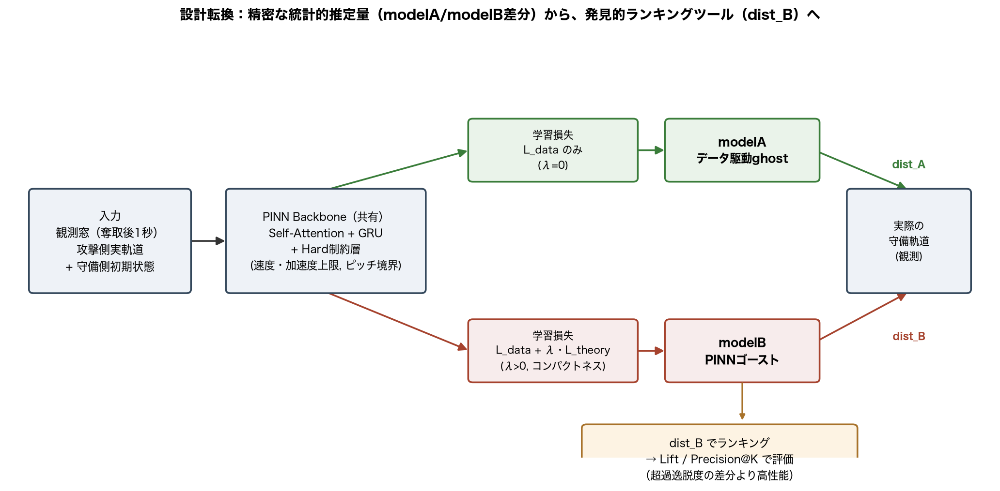

# ポスター原稿（研究会発表用）

構成は前回合意した4パネル案に基づく。図の挿入位置は`[図: ...]`で示す。文章量はポスターの1パネル分を想定し、簡潔にしている。

---

## タイトル案

**セオリーからの逸脱を発見する：物理制約×戦術理論のPINNゴーストによるサッカー守備分析**

副題（あれば）：ハード/ソフト制約つき軌道予測モデルによる、カウンター攻撃時の守備コンパクトネス評価

---

## 1. 背景・研究目的

サッカーのカウンター攻撃において、守備側が間延びせず「コンパクトネス」を保つことは、古典的な戦術セオリーとされる。しかし、実際のプレーが理論からどれだけ逸脱していたかを、トラッキングデータから定量的に見出す手法は確立していない。

単純に「守備の理想形」と実際の配置を比較するだけでは、その乖離が**理論への違反**なのか、**単に予測しにくい局面だった**だけなのかを区別できない。

本研究は、選手トラッキングデータ（idsse-data、Bundesliga 7試合、カウンター攻撃502件）を用い、物理的制約（ハード制約）と戦術理論（ソフト制約）を組み込んだ軌道予測モデル（PINN）で、この2つを分離して測定・発見する手法を提案する。

---

## 2. 手法

**ハード制約**（物理的に破れない）：最大速度・最大加速度・ピッチ境界を、モデルのアーキテクチャ内部（積分・射影層）に直接組み込む。損失関数に頼らず、構造的に違反を許さない。

**ソフト制約**（破りうる規範）：コンパクトネスという戦術理論を、損失関数へのペナルティ項として加える（強さはλで調整）。

**2つのghostモデル**
- **modelA**（データ駆動、λ=0）：理論なし、実際の守備行動を模倣する基準線
- **modelB**（PINNゴースト、λ>0）：理論に忠実な「あるべき守備」を生成

**設計転換：測定器から発見ツールへ**
当初は modelA/modelB の予測誤差の差分（超過逸脱度）を精密な統計的推定量として扱おうとしたが、7試合という小規模データでは、疑似反復・独立学習された2モデルの差分によるノイズ増幅・modelBの構造的バイアスといった問題に阻まれ、統計的有意性を確定できなかった。

そこで、逸脱度を「精密な推定量」としてではなく、**「発見的なランキングツール」**として使う設計に転換した。実際の守備とmodelBの距離（dist_B）でカウンター局面をランキングし、上位に成功シーンがどれだけ濃縮されるか（Lift/Precision@K）で評価する。この設計は、ランキング（相対順位）が構造的バイアス（ほぼ一定オフセット）の影響を受けにくいという利点も持つ。

---

## 3. 結果

**定量評価**：dist_Bによるランキングは AUC=0.610、上位10%でLift=1.94倍（成功率が全体平均11.4%の約2倍に濃縮）という、弱いが一貫した判別力を示した。

[図: 累積ゲイン曲線（lift_precision_at_k_cumulative_gains.png）]

**定性評価**：①PINNゴースト②ナイーブな理論最適化ゴースト（学習なし、コンパクトネス損失のみを直接最適化）③modelAの3者を代表シーンで比較した。②は攻撃の前進に追従できず「静止」するという不自然な失敗モードを示したのに対し、①PINNゴーストは③ほど自由ではないが②のような不自然さもなく、理論に忠実かつ動的に現実的な軌道を生成できることを確認した。

[図: 3者比較ケーススタディの代表画像（three_way_comparison_images/より1〜2枚）]

---

## 4. 考察・今後の展望

7試合という小規模データでは、統計的有意性を確定的に示すことはできなかった。これはデータ量の限界であり、方法論自体の欠陥ではないと考えている。実際、ランキングという評価枠組みへの転換により、構造的バイアスの影響を受けにくい、データ制約に見合った検証設計を実現できた。

**今後の展望**
- コンペで取得予定の大規模データ（約64試合）による再検証：統計的検出力の向上、疑似反復問題の軽減
- 反実仮想シミュレーションへの拡張：「もし守備がセオリー通りだったら、攻撃側の危険度はどう変わっていたか」を、失点シーンについて例示的に示す（攻撃側の反応を考慮しない、という限界は明記の上で）
- より長期的には、攻守が相互に反応し合うマルチエージェントモデルへの拡張も視野に入れる

---

## 付記：口頭説明用の補足材料（ポスターには載せない）

- 疑似反復・クラスタロバスト標準誤差による再検定（p=0.037→0.07〜0.14）
- 合成データによる構造的バイアスのキャリブレーション（構造的な下駄が実データの約64%を占める）
- λの応答パターン（0.1→0.25→0.5でピーク→8で崩壊、山型）
- dist_B単体 vs 超過逸脱度のベイクオフ（dist_B単体が全指標で優位）

これらは質問が出た際の口頭説明用に、詳細レポート（`documents/`配下の各報告書）を参照しながら答える。
