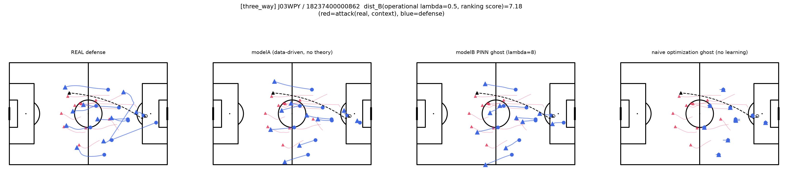
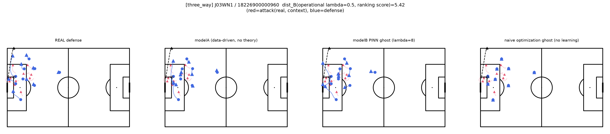
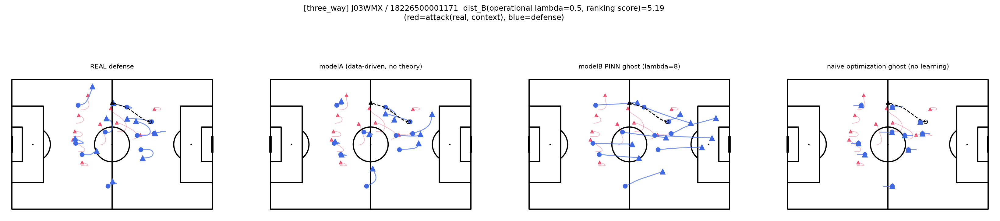

# 「なぜPINNが必要か」の3者比較ケーススタディ

計画書11.4節・11.9節項目2に対応。①PINNゴースト（modelB、λ=8のストレステスト設定）②ナイーブな理論最適化ゴースト（学習なし、コンパクトネス損失のみを直接最適化）③modelA（データ駆動、理論制約なし）の3者を代表シーンで比較し、「なぜ単純な最適化ではなくPINNが必要か」を定性的に示した。

コード：`scripts/three_way_comparison.py`。画像：`documents/three_way_comparison_images/`

## 方法

- 代表シーンは、11.9節項目1で採用したdist_B単体ランキングの上位から、試合の多様性を確保して3件選定（J03WPY, J03WN1, J03WMX）
- ①③は全502件（LOMO CVなし）で学習。②は学習を一切行わず、最終観測フレームの実位置を初期値として、コンパクトネス損失のみをAdamで直接最適化（データ項・ハード制約なし）
- ①には運用上のλ=0.5（ランキング用）とは別に、意図的に強めのλ=8を使用（11.5節：理論を強く効かせたときのPINNの優位性を示すストレステスト）

## 画像の見方

各図は1事例につき4パネル（左から順に：REAL＝実際の観測、modelA＝データ駆動・理論制約なし、modelB PINN ghost＝λ=8のPINNゴースト、naive optimization ghost＝学習なしのナイーブ最適化）を横に並べたもの。4パネルとも同じピッチ・同じ攻撃側（赤）を背景に、守備側（青）の軌道だけがパネルごとに異なる。

- **赤の線・三角マーカー**：攻撃側の実際の軌道（予測対象ではなく、条件として与えられる実観測のコンテキスト）。線は予測ホライズン全体の軌跡、三角マーカーは最終フレームの位置
- **青の線**：そのパネルにおける守備側の軌道（左端のみ実観測、他の3パネルはモデル／最適化による予測・生成軌道）
- **青の丸マーカー（○）**：守備側各選手の予測ホライズン開始時点（t=0、奪取直後）の位置
- **青の三角マーカー（▲）**：守備側各選手の予測ホライズン終了時点（約4秒後）の位置
- **黒の破線＋○/▲**：ボールの軌道（選手と同じ予測ホライズンの4秒間）。○が期間開始時点、▲が終了時点のボール位置
- **タイトルのdist_B**：この事例のランキングスコア（運用上のλ=0.5モデルによる、実観測とmodelBの距離）。値が大きいほど「実際の守備が理論的なゴーストから乖離している」と判定された事例

読み解き方のポイント：4パネルを左から右に見比べたとき、**青の軌道の長さ・向き**に注目する。REAL・modelA・modelB（PINN）では、青の線が右方向（攻撃側ゴール方向）に伸びている＝選手が攻撃の前進に応じて後退・追従している。一方naive optimization ghostでは、○と▲がほぼ同じ位置に重なり、線がほとんど見えない＝選手がその場から動いていない、という「静止」の失敗モードが視覚的に読み取れる。

## 結果

3事例すべてで一貫したパターンが観測された。

- **③modelA**：実際の守備の動きに近い、自然な追従的な動き
- **①modelB（PINNゴースト、λ=8）**：③よりまとまりのある陣形を保ちつつ、攻撃の前進に応じて選手が動いている
- **②ナイーブ最適化ゴースト**：想定していた「選手が1点に収束する」という失敗モードではなく、**初期位置からほぼ動かず「静止」する**という別の失敗モードが一貫して観測された。攻撃側（赤）は明確に前進しているのに、守備側（青）はほとんど位置を変えない

### 事例1：J03WPY / 18237400000862（dist_B=7.18、最も逸脱度が高い事例）

naive optimization ghost（右端）は、○と▲がほぼ重なり軌道の線がほとんど見えない。他の3パネルでは選手が広く動いている。

### 事例2：J03WN1 / 18226900000960（dist_B=5.42）

REAL・modelA・modelB（PINN）はいずれもペナルティエリア内で選手が動いているのに対し、naive optimization ghostは点のような静止したマーカーが目立つ。

### 事例3：J03WMX / 18226500001171（dist_B=5.19）

modelA・modelB（PINN）は攻撃の前進（赤）に応じて右方向へ伸びる軌道を描いているが、naive optimization ghostの軌道はごく短く、追従できていない。

## 解釈

ナイーブ最適化ゴーストが静止する理由：目標値`target_std`は実データ全体から計算された「典型的な」コンパクトネスの水準であり、カウンター奪取直後（t=0）の実際の守備配置は、すでにこの典型値に近いことが多い。ナイーブ最適化はコンパクトネス損失以外に動く動機（データへの忠実さ、時間方向の滑らかさ、攻撃の進行への追従）を一切持たないため、初期状態がすでに損失をおおよそ満たしていれば、それ以上動く理由がなく、そのまま「凍りついた」守備になる。

これは当初想定していた「1点への崩壊」とは異なる失敗モードだが、**PINNの必要性を示す論拠としては同等以上に説得力がある**：ナイーブな数理最適化は、目先の指標（コンパクトネス）だけを見て、試合の文脈（攻撃がどこに向かっているか、守備は本来それに応じて動くべきという時間的整合性）を一切考慮できない。①③はいずれも、攻撃の前進に応じて動的に反応している点で、②とは質的に異なる。

## 結論

3事例を通じて、「PINNゴーストは③ほど自由ではないが、②のような不自然さ（この場合は静止という形の不自然さ）もなく、セオリー通りかつ動的に現実的な動きになっている」ことが視覚的に確認できた。②の失敗モードは事前予想（1点への収束）と異なっていたが、これは「ナイーブな最適化は文脈への追従性を欠く」という、PINNの必要性を示す論点としてはむしろ分かりやすい実例になった。
