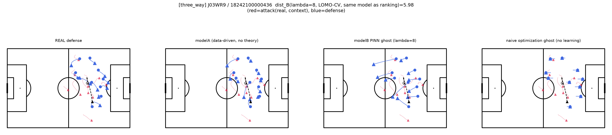

# 「なぜPINNが必要か」の3者比較ケーススタディ

計画書11.4節・11.9節項目2に対応。①PINNゴースト（modelB、λ=8のストレステスト設定）②ナイーブな理論最適化ゴースト（学習なし、コンパクトネス損失のみを直接最適化）③modelA（データ駆動、理論制約なし）の3者を代表シーンで比較し、「なぜ単純な最適化ではなくPINNが必要か」を定性的に示した。

コード：`scripts/three_way_comparison.py`。画像：`documents/three_way_comparison_images/`

## 【修正履歴】ランキングと可視化のモデル不一致を修正

初期版には2つの問題があった。

1. **事例選定に使ったdist_Bランキング**（λ=0.5・LOMO-CVアンサンブル、`excess_deviation_aggregated.pkl`由来）と、**実際にmodelBパネルに描画していたモデル**（このスクリプト内で全502件をin-sample学習したλ=8・単一seed）が別物だった
2. modelA・modelB(λ=8)とも、可視化対象のイベントを含む全502件で学習していた（ホールドアウトなし）ため、実観測に引っ張られて似た軌道になりやすかった

これは「指導現場向け可視化の試作」（`coaching_overlay_prototype_report.md`）を作る過程で発見された。本版では、①②とも**同一のλ=8・LOMO-CV（該当イベントの試合をホールドアウト）モデル**に統一し、7試合それぞれをホールドアウトして学習・予測してからdist_Bランキング・事例選定・可視化を行う。

**【追記2】デッドボール事例の除外**：この修正直後の版で選ばれた事例（J03WR9/18242100001234）は、ボールが予測ホライズンの4秒間、ピッチ外（x=-1.31、pitch範囲は[0,105]）で完全に静止しているデッドボール局面だったことが判明した（キーパーがボールを確保して静止している場面と推測される）。「PINN/modelAの差が最も大きい好例」として選んでいたが、実際のプレーがほぼ静止した特殊な局面でのモデルの振る舞いであり、活発なカウンター攻撃の事例として扱うのは不適切と判断した。予測ホライズン中のボールの総移動距離が5m未満の事例をあらかじめ除外するフィルタを選定ロジックに追加し（502件中56件が該当し除外）、再選定した。

## 方法

- 代表シーンは、上記の統一したλ=8・LOMO-CVのdist_Bランキングの上位から、試合の多様性を確保して3件選定
- 加えて、上位3件の成否のバランスを確認した上で、対照として**成功（label=1）に終わったシーンの中で最も逸脱度が高い事例**を4件目として追加
- ①③は該当試合をホールドアウトして残り6試合で学習（LOMO-CV）。②は学習を一切行わず、最終観測フレームの実位置を初期値として、コンパクトネス損失のみをAdamで直接最適化（データ項・ハード制約なし）
- ①には運用上のλ=0.5（ランキング用）とは別に、意図的に強めのλ=8を使用（11.5節：理論を強く効かせたときのPINNの優位性を示すストレステスト）

## 画像の見方

各図は1事例につき4パネル（左から順に：REAL＝実際の観測、modelA＝データ駆動・理論制約なし、modelB PINN ghost＝λ=8のPINNゴースト、naive optimization ghost＝学習なしのナイーブ最適化）を横に並べたもの。4パネルとも同じピッチ・同じ攻撃側（赤）を背景に、守備側（青）の軌道だけがパネルごとに異なる。

**攻撃方向は常に画面の左→右（ピッチ図の右端ゴールに向かって攻撃）**。データ読み込み時に正規化しており、どの事例・どのパネルでも共通（`Orientation.STATIC_HOME_AWAY`、`src/hs_pinn/trajectories.py`）。

**○→▲が表す時間範囲**：カウンター局面は「奪取直後1秒間（観測窓）＋その後4秒間（予測対象）」の合計5秒間で定義している。本図の○→▲が描くのは**後半の4秒間（奪取後1秒〜5秒）**で、観測窓（最初の1秒間）は含まれない。

### 凡例

| 記号 | 意味 |
|---|---|
| 赤の線 | 攻撃側の軌道（予測対象ではなく、条件として与えられる実観測のコンテキスト） |
| 赤の▲（三角） | 攻撃側各選手の、予測ホライズン**終了**時点（約4秒後）の位置 |
| 青の線 | そのパネルにおける守備側の軌道（左端REALのみ実観測、他3パネルはモデル／最適化による予測・生成軌道） |
| 青の○（丸） | 守備側各選手の予測ホライズン**開始**時点（t=0、奪取直後）の位置 |
| 青の▲（三角） | 守備側各選手の予測ホライズン**終了**時点（約4秒後）の位置 |
| 黒の破線 | ボールの軌道（選手と同じ予測ホライズンの4秒間） |
| 黒の○（丸） | ボールの、予測ホライズン**開始**時点の位置 |
| 黒の▲（三角） | ボールの、予測ホライズン**終了**時点の位置 |

**共通ルール：○（丸）＝4秒間の開始位置、▲（三角）＝4秒間の終了位置**。

- **タイトルのdist_B**：この事例のランキングスコア（modelB・λ=8・LOMO-CVによる、実観測とmodelBの距離）。今回の修正により、可視化しているmodelBパネルと完全に同じモデル・同じ値になっている

## 結果

| 事例 | dist_B | label |
|---|---|---|
| J03WPY / 18237400000862 | 7.92 | 0（失敗） |
| J03WMX / 18226500001171 | 7.01 | 0（失敗） |
| J03WR9 / 18242100000436 | 5.98 | 0（失敗） |
| J03WR9 / 18242103500847 | 5.51 | 1（成功） |

### 事例1：J03WPY / 18237400000862（dist_B=7.92）

modelA（③）はボックス外まで広がる軌道を示すのに対し、modelB PINN ghost（①）はボックス付近でよりまとまった、密集した陣形を保っている。naive optimization ghost（②）は選手の動きが乏しく、○と▲が近い。①③の差が視覚的に確認できる事例。

### 事例2：J03WMX / 18226500001171（dist_B=7.01）

REAL・modelA・modelB（PINN）はいずれも似た広がり方を示しており、①③の差は小さい。naive optimization ghost（②）は他と比べて選手の移動距離が短く、静止気味の傾向が見える。

### 事例3：J03WR9 / 18242100000436（dist_B=5.98）

ボールがハーフウェイ付近からボックス方向へ進む場面。REAL・modelAは実際の守備がボール周辺に密集する軌道を示すのに対し、modelB PINN ghost（①）は1選手がハーフウェイライン付近まで大きく開く、視覚的にはっきりした差が見える。naive optimization ghost（②）は短い移動に留まる。

### 事例4：J03WR9 / 18242103500847（dist_B=5.51、成功シーン）

REAL・modelA・modelBはいずれも似た軌道を示しており、①③の差は小さい。naive optimization ghost（②）は他パネルより移動が乏しい。

## 解釈

4事例中2件（事例1・3）では①（PINN ghost）と③（modelA）の間に視覚的にはっきりした差が見えたが、残り2件（事例2・4）では差が小さく、REAL・modelA・modelBがほぼ同じ広がり方を示した。

この「はっきり見える事例とそうでない事例が混在する」という結果は、これまでの定量結果（dist_B単体のAUC=0.610、`lift_precision_at_k_report.md`）が示す「弱いが一貫して本物」という効果量をそのまま反映したものと理解するのが正確である。今回の修正（ランキングと可視化のモデル統一・LOMO-CV化）によって、修正前は4事例ともほぼ差が見えなかったのに対し、少なくとも2事例では明確な差を再現できるようになった点は、修正の効果として記録しておく。

一方、②ナイーブ最適化ゴーストについては、4事例すべてで一貫して「選手の移動が乏しい・静止気味」という傾向が見られ、これは修正前の結論（初期状態がすでに損失をおおよそ満たしていれば動く理由がなく、文脈への追従性を欠く）と変わらない。②に対する①③の優位性という、この比較の主目的である結論は、今回の修正後も変わらず成立している。

## 結論

修正の結果、①PINNゴーストと③modelAの視覚的な差は、事例によっては明確に確認できるようになった（特に事例3）。ただし全事例で一貫して大きな差が出るわけではなく、これは効果量そのものが弱いことの反映であり、可視化の設計だけでは解決できない限界である。②ナイーブ最適化ゴーストの「静止」という不自然な失敗モードは今回も一貫して確認され、「PINNゴーストは③ほど自由ではないが②のような不自然さもない」という結論は、修正後も変わらず支持される。
